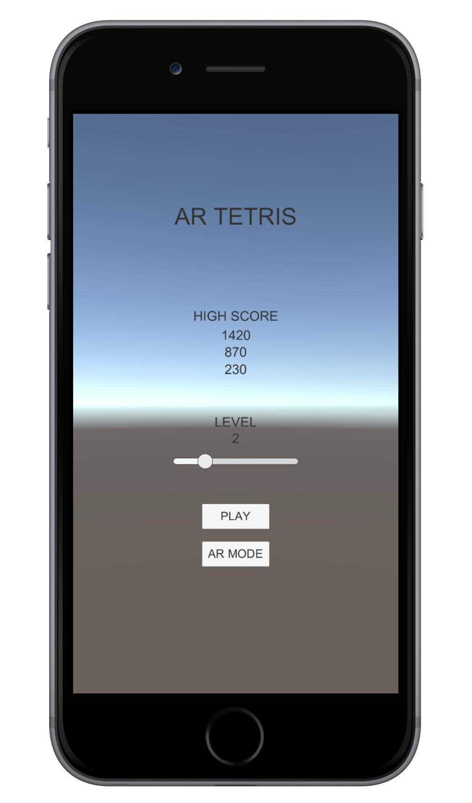
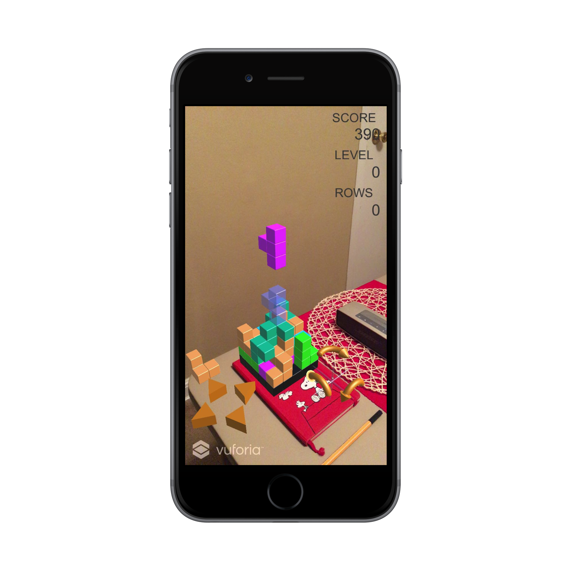

# AR-3D-Tetris
AR 3D Tetris on iPhone.

Now perfectly running on iOS 10...

## Description
Using Unity and Vuforia SDK to build an augmented reality tetris game. Recognizing and tracking a marker, the game allows users to play 3D tetris right on their table through handheld displays (iPhone or iPad).

## Screenshots

 

## Game Demo

## Resource
- [BitTiger Project: AR 3D Gift Card](https://www.bittiger.io/videos/WgJ3wYzX5NGiDEkNi/pZZmpXCYiQ6c6ZRdm)
- [Unity 3D](http://unity3d.com/)
- [Vuforia SDK](http://www.vuforia.com/)
- [Tetris Clone Tutorial by The Weekly Coder](https://www.youtube.com/playlist?list=PLiRrp7UEG13axMHD7Kqdiy30c7ZBu_Zn7)
- [Blender 2.7 Tutorial Series by BornCG](https://www.youtube.com/playlist?list=PLda3VoSoc_TR7X7wfblBGiRz-bvhKpGkS)

## License
TBD

## Project Information
- category: mobile
- team: ARworks
- description: 3D AR Tetris game on iPhone.
- stack: Unity, Vuforia, iOS, blender
